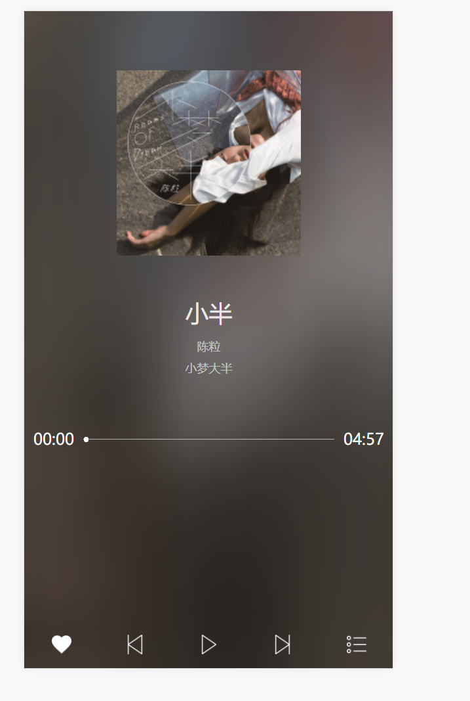
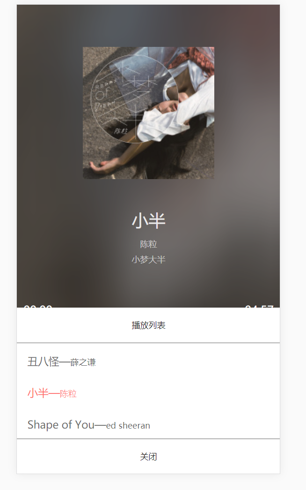

MusicBox
=========
- 技术： html5 + css3 + less + es6 + gulp + zepto
- Less 是一门 CSS 预处理语言,它扩展了 CSS 语言,增加了变量、Mixin、函数等特性。
- Gulp.js 是一个自动化构建工具,开发者可以使用它在项目开发过程中自动执行常见任务。
- Zepto是一个轻量级的针对现代高级浏览器的JavaScript库， 它与jquery有着类似的api。
- 该项目musicBox简单实现了显示歌曲信息，进度条及进度条拖拽，点击播放及点击上一首下一首，点击喜欢，点击列表。

